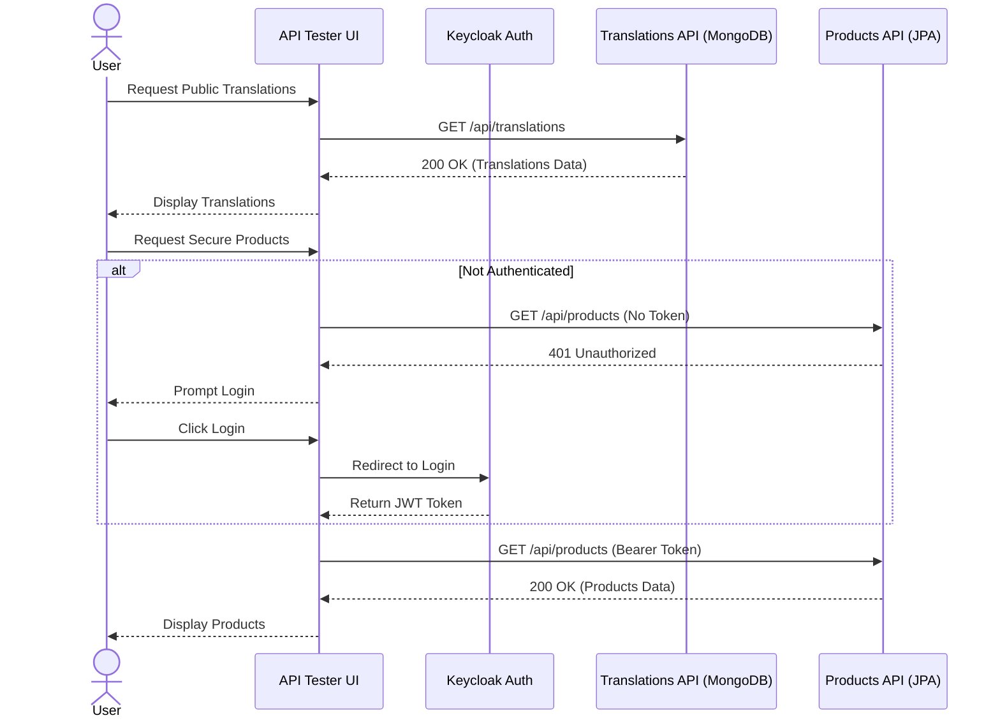
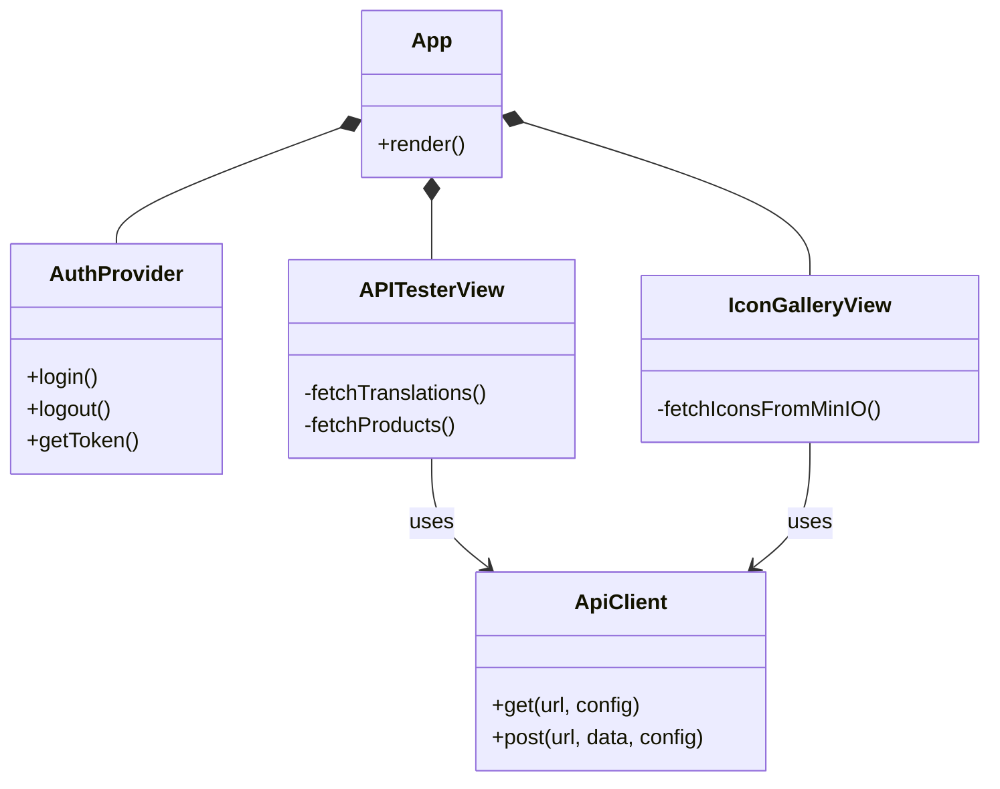
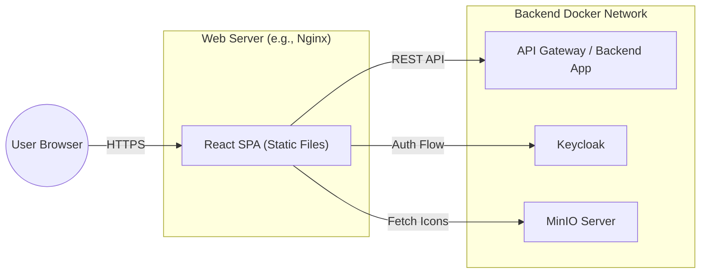

# Frontend UX and Architecture Diagrams

This document outlines the planned architecture and interaction flows for the React TypeScript frontend.

## 1. System Architecture (Component Diagram)

This diagram illustrates the high-level architecture, showing how the frontend interacts with various backend submodules and external services.

```mermaid
graph TD
    subgraph Frontend["React TypeScript Frontend"]
        App["App Container"]
        AuthCtx["Auth Context (Keycloak)"]
        APITester["API Tester UI"]
        IconGallery["Icon Gallery (MinIO)"]
    end

    subgraph Backend["Backend API Gateway / Submodules"]
        TranslationsAPI["/api/translations (Public)"]
        ProductsAPI["/api/products (Secure)"]
    end

    subgraph Infrastructure["Infrastructure & Data Services"]
        Keycloak["Keycloak (Identity Provider)"]
        MongoDB["MongoDB (Translations Data)"]
        PostgreSQL["PostgreSQL / JPA (Products Data)"]
        MinIO["MinIO (Icon Storage)"]
    end

    App --> AuthCtx
    App --> APITester
    App --> IconGallery

    AuthCtx -->|Authenticate| Keycloak
    
    APITester -->|GET public data| TranslationsAPI
    APITester -->|GET secure data (w/ Token)| ProductsAPI
    
    IconGallery -->|Fetch static icons| MinIO
    
    TranslationsAPI --> MongoDB
    ProductsAPI --> PostgreSQL
```

## 2. API Tester Sequence Diagram

This sequence diagram details the flow of user interactions within the API tester, specifically handling public and secure API calls, along with authentication.



## 3. Class/Component Structure (Frontend)



## 4. Deployment Architecture


